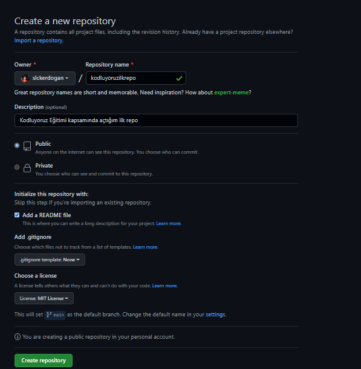

# Kodluyoruz İlk Repo
---
 
Bu repo <a href="https://kodluyoruz.org/tr/kodluyoruz/">Kodluyoruz Front-End Eğitiminde oluşturduğumuz ilk repo. İçerisinde bir adet README dosyası, bir adet de index.html barındırıyor.

## Installation
---
Öncelikle projeyi clonelayın.(Buraya sizin reponuzdan aldığınız link gelecek.)

https://github.com/slckerdogan/kodluyoruzilkrepo.git

## Usage
---
Projeyi cloneladıktan sonra Vsiaul Studio Code programında açınız.

Linux için:

 cd kodluyoruzilkrepo
 code . 

## Contributing
---
Pull requestler kabul edilir. Büyük değişiklikler için, lütfen önce neyi değiştirmek istediğinizi tartışmak için bir konu açınız.

## Licence
---
<a href="https://choosealicense.com/licenses/mit/">MIT

